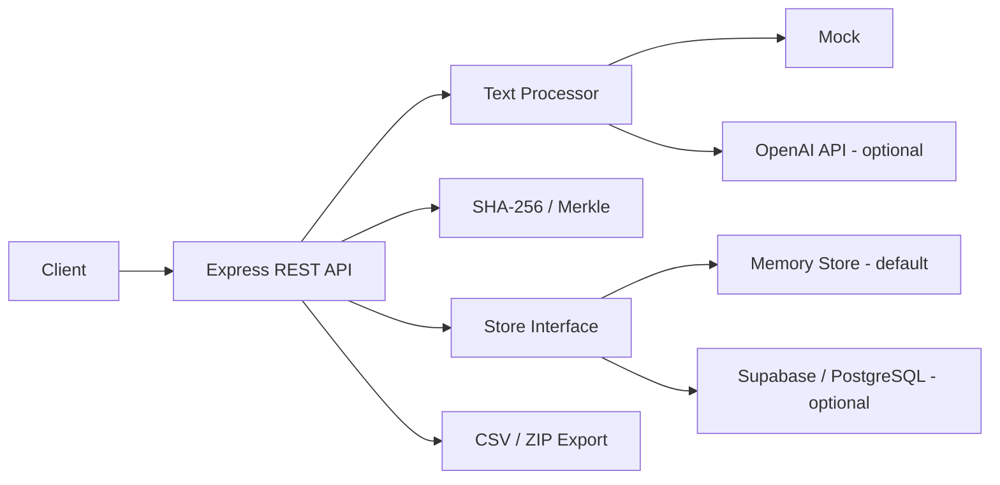

# Audit Trail Backend Demo

A backend portfolio project built with **Node.js and Express** for handling processing jobs, resource registration, audit logs, and hash-based verification.

> A portfolio demo of a backend API with audit logging, SHA-256 hashing, optional Supabase persistence, and optional OpenAI integration.

## About This Repository

This repository is a **redesigned and reimplemented portfolio project** based on backend development experience from a previous contract engagement.

To make the project safe for public release, all **confidential information, customer information, production environment details, and project-specific business logic have been removed or replaced**.

This repository does **not** contain source code copied directly from the original production project, real customer data, credentials, production domains, original database schemas, or internal documents.

## Features

- Create processing jobs through REST APIs
- Generate SHA-256 digests for inputs, outputs, and resources
- Record audit events in a common format
- Represent audit batches using a Merkle root
- Search audit history by job ID or resource hash
- Export audit data as CSV / ZIP
- Switch between in-memory storage and Supabase / PostgreSQL
- Switch between mock processing and optional OpenAI API processing
- Unit tests using the built-in Node.js test runner

## Architecture



For more details, see [`docs/ARCHITECTURE.md`](docs/ARCHITECTURE.md).

## Tech Stack

| Category | Technology |
|---|---|
| Runtime | Node.js 20+ |
| Web Framework | Express |
| Database | PostgreSQL / Supabase (optional) |
| Hashing | Node.js `crypto` / SHA-256 |
| Export | CSV / ZIP |
| External API | OpenAI API (optional) |
| Testing | Node.js test runner |

## Project Structure

```text
.
├── src/
│   ├── app.js
│   ├── config.js
│   ├── server.js
│   ├── services/
│   │   ├── auditService.js
│   │   └── processor.js
│   ├── store/
│   │   ├── index.js
│   │   ├── memoryStore.js
│   │   └── supabaseStore.js
│   └── utils/
│       └── hash.js
├── sql/
│   └── schema.sql
├── docs/
│   ├── API.md
│   └── ARCHITECTURE.md
├── tests/
│   └── hash.test.js
├── .env.example
├── .gitignore
├── .nvmrc
└── package.json
```

## Quick Start

### 1. Requirements

- Node.js 20 or later
- npm

### 2. Install Dependencies

```bash
npm install
```

### 3. Configure Environment Variables

```bash
cp .env.example .env
```

On Windows PowerShell:

```powershell
Copy-Item .env.example .env
```

### 4. Start the Server

```bash
npm start
```

By default, the project uses:

```env
STORAGE_MODE=memory
PROCESSOR_MODE=mock
```

This means the application can run **without external service accounts or API keys**.

After starting the server:

```bash
curl http://localhost:3000/healthz
```

## API Endpoints

| Method | Path | Description |
|---|---|---|
| GET | `/healthz` | Health check |
| GET | `/version` | API version |
| POST | `/api/jobs` | Create a processing job and record hashes |
| POST | `/api/feedback` | Record feedback for a job |
| POST | `/api/resources` | Register a SHA-256 digest for a resource |
| GET | `/api/verify?id=...` | Search related audit events |
| GET | `/api/audit/export` | Export audit data as CSV / ZIP |

See [`docs/API.md`](docs/API.md) for request examples.

## Storage Configuration

The default storage implementation is in-memory:

```env
STORAGE_MODE=memory
```

To use Supabase, run `sql/schema.sql` and configure:

```env
STORAGE_MODE=supabase
SUPABASE_URL=your-project-url
SUPABASE_KEY=your-key
```

## Optional OpenAI Integration

To enable OpenAI-based processing:

```env
PROCESSOR_MODE=openai
OPENAI_API_KEY=your-api-key
OPENAI_MODEL=your-model-name
```

API keys and connection information should be stored in `.env` and must not be committed to Git.

## Design Highlights

### 1. Easy Local Evaluation

The default configuration uses in-memory storage and mock processing so that reviewers can run the project without creating external service accounts.

### 2. Storage Abstraction

Storage logic is separated from the API layer. The application can switch between `MemoryStore` and `SupabaseStore` without changing the route-level logic.

### 3. Consistent Audit Event Model

Processing jobs, feedback, and resource registrations are stored using a common audit event structure, making it possible to trace related operations chronologically.

### 4. Digest-Based Resource Tracking

For resource registration, the project demonstrates storing a SHA-256 digest instead of retaining the original content itself.

### 5. Separation of Secrets and Source Code

API keys and connection settings are loaded from environment variables. Only `.env.example` is included in the repository.

## Tests

Run the test suite with:

```bash
npm test
```

## Portfolio Scope

This project is intended to demonstrate experience with:

- Backend API development using Node.js / Express
- Data integration with PostgreSQL-based services
- Hash generation and audit logging
- Environment-based configuration management
- Backend structure designed with server deployment in mind

Project-specific names, customer data, credentials, production environment information, and proprietary business logic are intentionally excluded.

## Production Considerations

This repository is a portfolio demonstration rather than a production-ready service.

A production deployment would require additional measures such as:

- Authentication and authorization
- Rate limiting
- Stricter input validation
- CORS policy configuration
- Access control for audit logs
- PostgreSQL / Supabase row-level security
- Monitoring and observability
- Secure secret management
